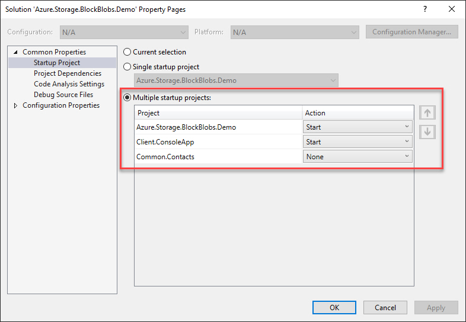
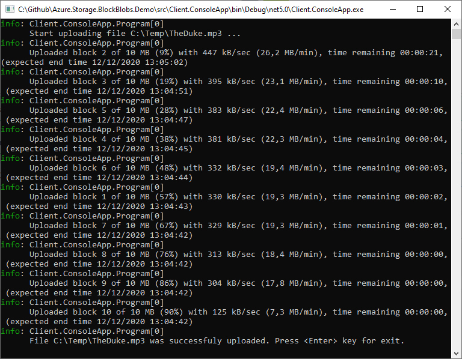

# Upload (large) files to Azure Block Blobs

## Introduction
What's happening with the Azure.Storage.Blobs library has been very turbulent since version 11. Many breaking changes and a brand new architecture. So it was a real challenge for me to prepare this demo with the help of the latest version of the library (12.x). The demo consists of three projects: Common.Contracts library, WebAPI and a simple console app which can upload a file to the Azure Block Blob in blocks (chunks) in parallel (multiple threads). But first, some explanations.

## What are Block Blobs?
Block blobs are optimized for uploading large amounts of data efficiently. Block blobs are comprised of blocks, each of which is identified by a block ID. A block blob can include up to 50,000 blocks. Each block in a block blob can be a different size, up to the maximum size permitted for the service version in use.

When you upload a block to a blob in your storage account, it is associated with the specified block blob, but it does not become part of the blob until you **commit a list of blocks** that includes the new block's ID. New blocks remain in an uncommitted state until they are specifically committed or discarded. There can be a maximum of 100,000 uncommitted blocks. Writing a block does not update the last modified time of an existing blob.

Block blobs include features that help you manage large files over networks. With a block blob, you can upload multiple blocks in parallel to decrease upload time. Each block can include an MD5 hash to verify the transfer, so you can track upload progress and re-send blocks as needed. You can upload blocks in any order, and determine their sequence in the final block list commitment step. You can also upload a new block to replace an existing uncommitted block of the same block ID. You have one week to commit blocks to a blob before they are discarded. All uncommitted blocks are also discarded when a block list commitment operation occurs but does not include them.

The size of a single block blob is higher than the normal, 4.75 TB, so the total size is 100 MB x 50,000 blocks.

Source: [Microsoft documentation](https://docs.microsoft.com/en-us/rest/api/storageservices/understanding-block-blobs--append-blobs--and-page-blobs)

## Let’s start
For a testing we will use **Azure Storage Emulator**. Microsoft documentation says that is a tool that emulates the Azure Blob, Queue, and Table services for local development purposes. You can test your application against the storage services locally without creating an Azure subscription or incurring any costs. When you're satisfied with how your application is working in the emulator, switch to using an Azure storage account in the cloud.
According to this we have to adjust storage account connection string in **Azure.Storage.BlockBlobs.Demo** **appsettings.json/launchSettins.json**:
```json
{
  "BlobStorage": {
    "ConnectionString": "UseDevelopmentStorage=true",
    "ContainerName": "demo-container"
  },
  "Logging": {
    "LogLevel": {
      "Default": "Information",
      "Microsoft": "Warning",
      "Microsoft.Hosting.Lifetime": "Information"
    }
  },
  "AllowedHosts": "*"
}
```

In the **Client.ConsoleApp** project **appsettings.json** file we have to adjust WebAPI endpoints and full path to file which we want to upload:
```json
{
  "AppConfig": {
    "StageBlockUri": "http://localhost:5000/blob/stageblock",
    "CommitBlocksUri": "http://localhost:5000/blob/commitblocks/{0}",
    "FullPathFileName": "C:\\Temp\\TheDuke.mp3",
    "MaxThreads": "4",
    "BlockSize": "1048576" // 1MB
  },
  "Logging": {
    "LogLevel": {
      "Default": "Information",
      "Microsoft": "Warning",
      "Microsoft.Hosting.Lifetime": "Information"
    }
  },
  "AllowedHosts": "*"
}
```
Our last step is to select startup projects:


After execution, console application starts with file upload and reports simple upload statistics...


## Conclusion
This demo shows how to with minimal effort upload any file to the Azure Block Blob using Azure Storage Blobs client library. Of course it's not production ready. But you can use it as a starting point for your real-world project. Enjoy!

## Prerequisites
- [Visual Studio](https://www.visualstudio.com/vs/community) 2019 16.8.2 or greater 

## Tags & Technologies
- [Azure Storage Blobs](https://docs.microsoft.com/en-us/azure/storage/blobs/storage-blobs-overview)
- [Azure Storage Emulator](https://docs.microsoft.com/en-us/azure/storage/common/storage-use-emulator)  
- [Azure.Storage.Blobs Nuget client library](https://www.nuget.org/packages/Azure.Storage.Blobs)

## Licence
Licenced under [MIT](http://opensource.org/licenses/mit-license.php).
Contact me on [LinkedIn](https://si.linkedin.com/in/matjazbravc).
